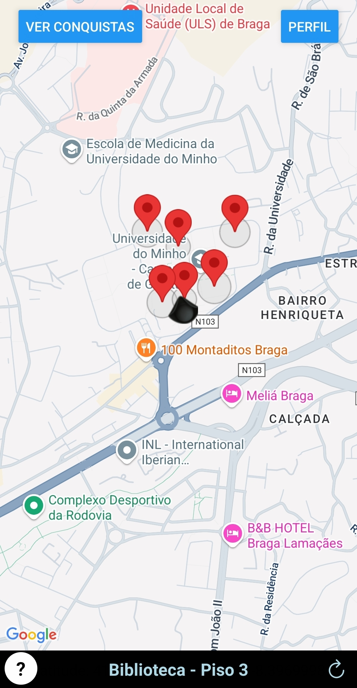

# 📍 UminhoApp

Welcome to **UminhoApp**, a mobile application designed to enhance the experience of students at the University of Minho. This app offers a range of features to help students navigate the campus more easily, access detailed building information, track achievements through a gamified badge system, and consult essential university resources.

**UminhoApp** leverages modern technologies such as geofencing, which allows the app to detect when users enter or exit specific campus buildings, providing contextual information automatically. Additionally, the app integrates smartphone sensors like GPS, barometer, and compass to offer precise indoor and outdoor navigation, including floor detection and orientation.

Built with React Native and Expo Go, the app is cross-platform, providing a seamless experience on both Android and iOS devices. Authentication is managed via Firebase to ensure secure and personalized access for users.

Whether you're a new student, UminhoApp aims to simplify your campus life, foster exploration, and support academic integration.

<div align="center">
   
</div>
---

## 🌟 Features

### 🗺️ **Interactive Campus Map**  
- Explore detailed information about university buildings.  
- Receive real-time updates on your location within the campus.  
- Use the **Finder** tool to easily navigate to specific buildings.


### 🏆 **Achievements & Badges**  
- Unlock badges by visiting buildings and completing challenges.  
- Track your progress and achievements in the dedicated section.

### 📚 **FAQ Section**  
- Access clear answers to common questions about university life and available services.

### 📡 **Barometer & Floor Detection**  
- Discover which floor you are on using the barometer sensor.  
- Manually calibrate the barometer for improved accuracy.

### 🧭 **Compass Integration**  
- Navigate with a built-in digital compass adjusted for true north.

### 🔐 **Authentication**  
- Secure login and registration using Firebase Authentication for personalized access.

---

## 📱 Screenshots

<p align="center">
  
  
  
</p>

---

## 🚀 Getting Started

### Prerequisites
- Install [Node.js](https://nodejs.org/) and [Expo CLI](https://docs.expo.dev/get-started/installation/).

### Installation
1. Clone the repository:
   ```bash
   git clone https://github.com/your-username/UminhoApp.git
   cd UminhoApp
   ```

2. Install dependencies:
   ```bash
   npm install
   ```

3. Start the app:
   ```bash
   npx expo start
   ```

4. Open the app on your device using:
   - **Expo Go** (scan the QR code).
   - Android Emulator or iOS Simulator.

---

## 🛠️ Tech Stack

- **React Native**: For building the mobile app.
- **Expo**: For rapid development and deployment.
- **Firebase**: For authentication and Firestore database.
- **React Navigation**: For seamless navigation.
- **TypeScript**: For type safety and better developer experience.

---

## 📂 Project Structure

```
UminhoApp/
├── app/                # Screens and navigation
├── components/         # Reusable UI components
├── constants/          # Configuration and helpers
├── assets/             # Images, fonts, and static files
├── hooks/              # Custom React hooks
├── scripts/            # Utility scripts
└── README.md           # Project documentation
```

---

## 🎯 Future Features

- **Push Notifications**: Stay updated with university events.
- **Event Calendar**: View upcoming events and deadlines.
- **Offline Mode**: Access essential features without an internet connection.

